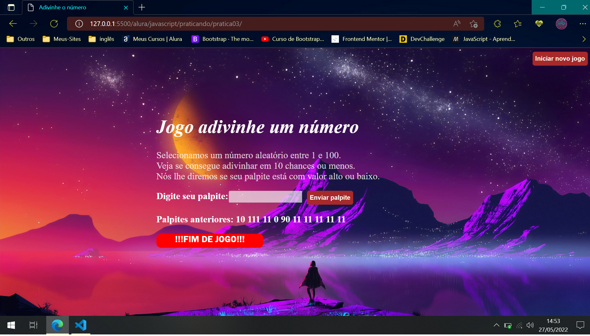

# Jogo do adivinha

Praticando javascript com um jogo de adivinhar os números

## Table of contents

- [Screenshot](#screenshot)
- [Links](#links)
- [Author](#author)

### Screenshot

### Links

- Solution URL: [Solution here](https://ingridssilveira.github.io/adivinha/)

## Author

- Website - [Ingrid Souza](https://ingridssilveira.github.io/IngridSouza)
- GitHub - [@IngridsSilveira](https://github.com/IngridsSilveira)